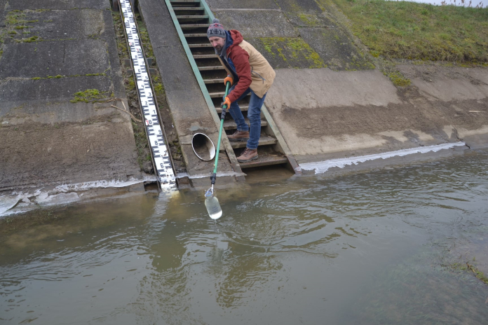

<a href="https://epito.bme.hu/patziger-miklos" target="_blank"> Dr. Patziger Miklós:</a> A BME Vízi Közmű és Környezetmérnöki Tanszék egyetemi docense, tanszékvezető.   

<a href="http://epito.bme.hu/muranyi-gabor" target="_blank"> Murányi Gábor:</a> A BME Vízi Közmű és Környezetmérnöki Tanszék negyedéves doktorandusz hallgatója. Kutatási témája alternatív árvízvédelmi megoldások stratégiai lehetőségeinek tudományos megalapozása. 

<a href="https://vkkt.bme.hu/szepvolgyi-viktoria" target="_blank"> Szépvölgyi Viktória:</a> A BME Vízi Közmű és Környezetmérnöki Tanszék elsőéves doktorandusz hallgatója. Kutatási témája az anaerob szennyvíziszap stabilizáció hatékonyságának növelése, a rothasztók hatástényezőinek optimalizálása.

<a href="https://epito.bme.hu/vkkt/munkatarsak" target="_blank">BME VKKT kollégái</a>

Kinyitja kapuit a BME Vízi Közmű és Környezetmérnöki Tanszék vízanalitika laboratóriuma. Technológiai bemutatókkal, kísérletekkel és kisminta modellekkel várjuk a kedves érdeklődőket!

 