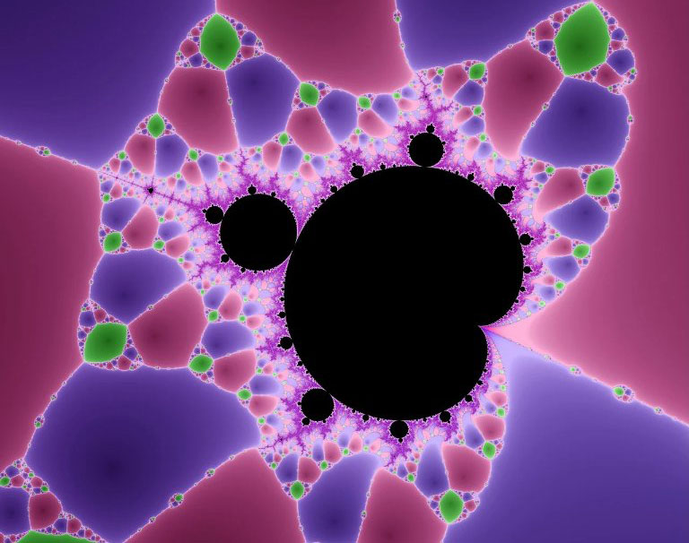

<b>Tasnádi Tamás</b>: a BME TTK Matematika Intézetének egyetemi adjunktusa. Kutatási területei a dinamikai rendszerek vizsgálata és a káosz jelenségeinek vizsgálata. 

Mi az a Penrose parkettázás, mitől lesz kaotikus egy inga és mi köze van mindennek a fraktálokhoz és a Mandelbrot halmazhoz?

  

