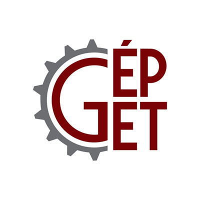

<a href="https://epget.bme.hu/oktatoi_oldal.php?lepes=4&oid=140" about:_blank> Dr. Szánthó Zoltán</a> 
<a href="https://epget.bme.hu/oktatoi_oldal.php?lepes=4&oid=118" about:_blank> Dr. Hégely László</a> 
<a href="https://epget.bme.hu/oktatoi_oldal.php?lepes=4&oid=148" about:_blank> Dr. Deme Bélafi Zsófia</a> 
<a href="https://epget.bme.hu/oktatoi_oldal.php?lepes=4&oid=112" about:_blank> Dr. Czétány László</a> 
<a href="https://epget.bme.hu/oktatoi_oldal.php?lepes=4&oid=110" about:_blank> Dr. Both Balázs</a> 
<a href="https://epget.bme.hu/oktatoi_oldal.php?lepes=4&oid=143" about:_blank> Varjú Evelin</a> 
<a href="https://epget.bme.hu/oktatoi_oldal.php?lepes=4&oid=107" about:_blank> Dr. Barna Edit Orsolya</a> 
<a href="https://epget.bme.hu/oktatoi_oldal.php?lepes=4&oid=121" about:_blank> Horváth Dániel</a>

A BME Épületgépészeti és Gépészeti Eljárástechnika Tanszék Stokes, Macskásy és Légtechnikai Laborjainak bemutatása
  
 
  
