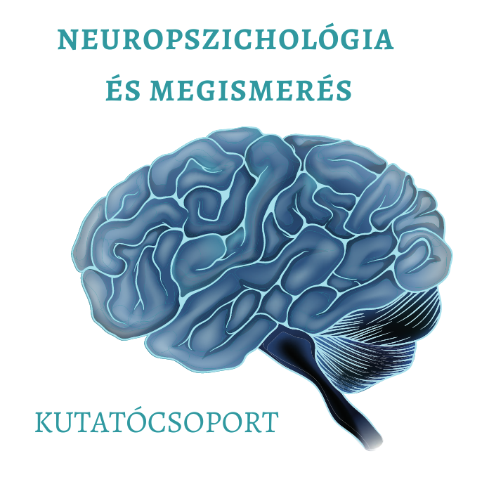

<b>Demeter Gyula</b>: több éve végez neuropszichiátriai és neuropszichológiai kutatásokat és tart kurzusokat különböző neuropszichológiai témákban a BME Kognitív Tudományi Tanszékének oktatójaként. Neuropszichológusként az OMINT-OORI Agysérültek Rehabilitációs Osztályán agysérült betegek rehabilitációjában vesz részt.

<b>Lencsés Anita, Mikula Bernadett és Zsebi Soma</b>: a prospektív emlékezet, illetve a szociális kogníció és végrehajtó funkciók vizsgálatával foglalkoznak egészséges és sérült személyeknél egyaránt. Demeter Gyula vezetése mellett kutatásokat folytatnak a BME TTK Kognitív Tudományi Tanszékén és az OMINT-OORI intézetében.

Az érdeklődők a félórás sávokban izgalmas kognitív tesztek kitöltése alapján megismerhetik saját emlékezeti képességeiket, valamint visszajelzést kaphatnak arról, hogy hogyan működik a munkamemória, a rövid távú emlékezet vagy épp a prospektív memória.

  
