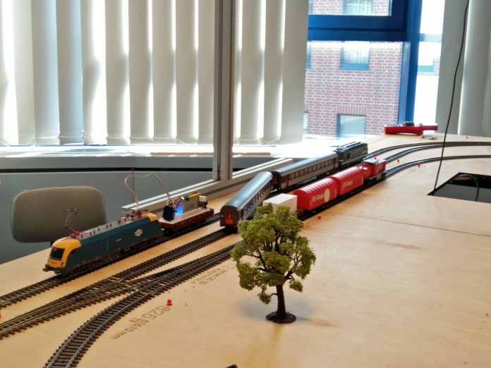

<b>Horváth Benedek:</b> A linzi Johannes Kepler Egyetem és a budapesti IncQuery Labs Zrt. PhD hallgatója. Témavezetői: Prof. Manuel Wimmer, Dr. Horváth Ákos és Dr. Ráth István. Fő kutatási területe elosztott, párhuzamos, reaktív modelltranszformációk skálázódásának javítása felhőalapú rendszerekben. BSc és MSc évei alatt aktív szerepet vállalt egy modellvasút terepasztal létrehozásában, a vasúti rendszerek biztonságának demonstrálása céljából.

Az előadásban egy számítási-felhőalapú megoldást mutatunk be, vasútfelügyeleti rendszerek helyességének ellenőrzésére. A számítási felhők nagymennyiségű számítási erőforrást tesznek könnyen hozzáférhetővé, mellyel ezen számítások gyorsan elvégezhetőek.

  
 