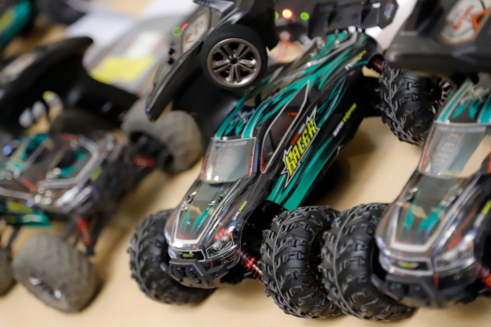

<b>Dr. Németh Balázs</b>: a BME Közlekedés- és Járműirányítási Tanszékének címzetes egyetemi docense, oktatási és kutatási területe az önvezető járművek irányítórendszereinek tervezési kérdései. Mérnöki-kutatói hivatása mellett egyben református lelkész.

 
Milyen lehet szembeszállni egy robotjárművel? Ki tudja jobban megtalálni a pályán az ideális ívet? A BME KJK és a Mérnökmisszió közös versenyének, a REFORMula Challenge új szériájának egy bemutató programján kipróbálhatod, milyen versenyezni egy önvezető kisjármű ellen. A program során nem csak vezetésre van lehetőség, hanem kérdezhetsz az Egyetem kutatóitól is a rendszer működéséről.
 
   
 