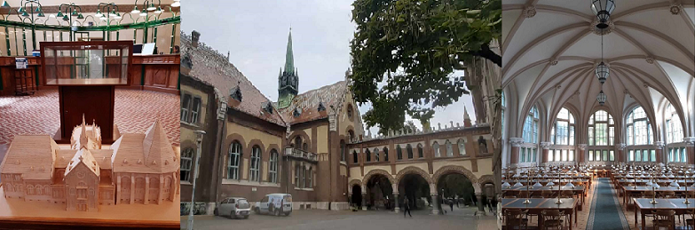

A Könyvtár patináns épületének bejárása, megismerése, a látogatók, könyvtárhasználók számára korlátozottan látogatható vagy akár elzárt területek bejárása, bemutatása, amelynek során a Könyvtár épületének és magának az intézménynek a történetéről rövid előadás, érintve az állományi érdekéssegeket is.

