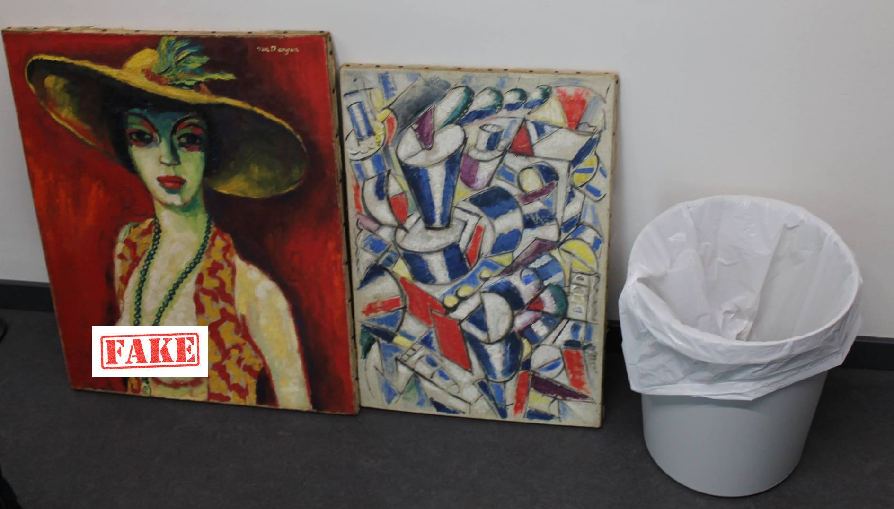

[Dr. Lőrincz Viktor](https://jog.tk.hu/kutato/lorincz-viktor) művészettörténész diplomáját az ELTE-n, jogi diplomáját az ELTE-n és a Paris 1 Panthéon-Sorbonne egyetemeken, gazdaságpszichológus diplomáját a Paris 5 Descartes egyetemen szerezte, a Társadalomtudományi Kutatóközpont tudományos segédmunkatársa és a Magyar Tudományos Akadémia Művészeti Gyűjteményének tudományos munkatársa, az Acta Juridica - Hungarian Journal of Legal Studies felelős társszerkesztője. A francia kormány, az Île-de-France régió, a Magyar Állami Eötvös Ösztöndíj, a Sasakava Young Leader Fellowship, és az Ernst Mach Stipendium ösztöndíjasa volt. Publikációi jelentek meg angol, francia, német és magyar nyelven.

[Dr. Víg Zoltán](https://law.bme.hu/munkatarsaink ) jogi diplomát a Szegedi Egyetem Állam- és Jogtudományi Karán szerzett (1998), majd ezt követően LLM (1999) és SJD (PhD) (2006) fokozatokat nemzetközi üzleti jogból a budapesti Közép-európai Egyetemen (CEU). Kutatói ösztöndíjjal dolgozott a Max Planck és az Asser Intézetekben, a Humboldt, Hamburgi, Emory és a Yale Egyetemeken. Öt évig volt a Magyar Tudományos Akadémia kutatója. Gyakorlati tudást a Freshfields Bruckhaus Deringer és a DBP Advokati nemzetközi ügyvédi irodánál szerzett.Több könyve és cikke jelent meg magyar, angol, szerb és német nyelveken. Oktatói karrierje során többek között olyan tárgyakat oktatott mint a nemzetközi beruházási jog, nemzetközi gazdasági jog, társasági jog, EU joga.

Az előadás a hamis műtárgyak piacával (több érdekes példát is megemlítve) és a hamis műtárgyakra és azok kereskedelmére vonatkozó jogi szabályozással foglalkozik.

