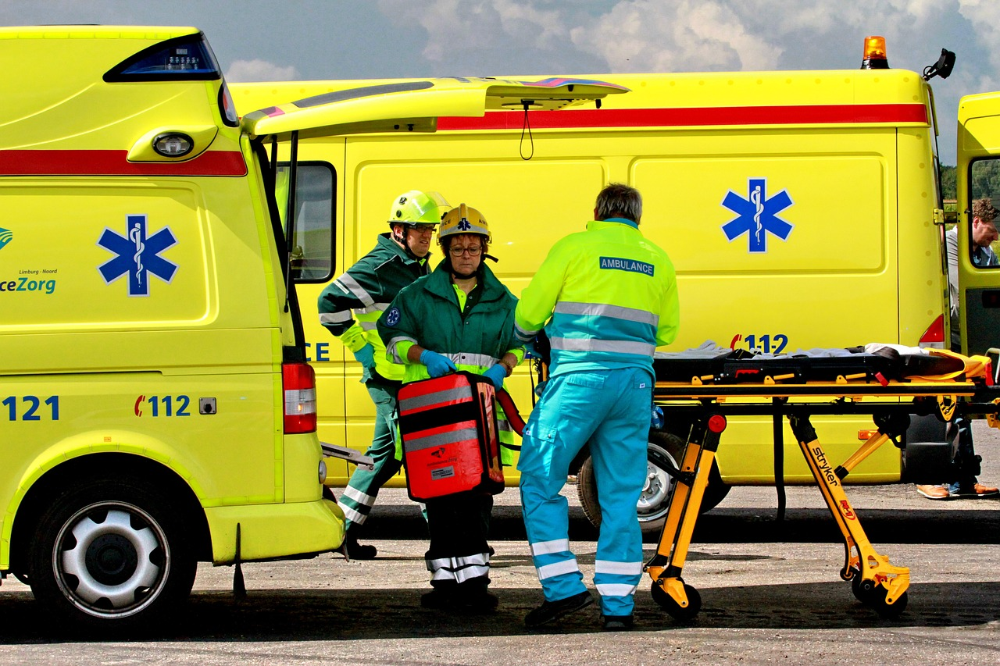

**Kovács Márton** (barlangi mentő), **Vörös László** (baleseti helyszínelő), **Juhász Gábor Pál** (mentőtechnikus, gépjárművezető-szakoktató)

A program során 3 rövid előadáson keresztül ismerhetik meg a látogatók a bemutatott szakmák érdekességeit. Ezután egy pódiumbeszélgetésen keresztül tárjuk fel, milyen személyiségjegyek kellenek ahhoz, hogy valaki sikeres  elsősegélynyújtó legyen, mi tanulható a hatékony balesetkezeléshez, és hogyan kerüljük el  a baleseti helyzeteket.

