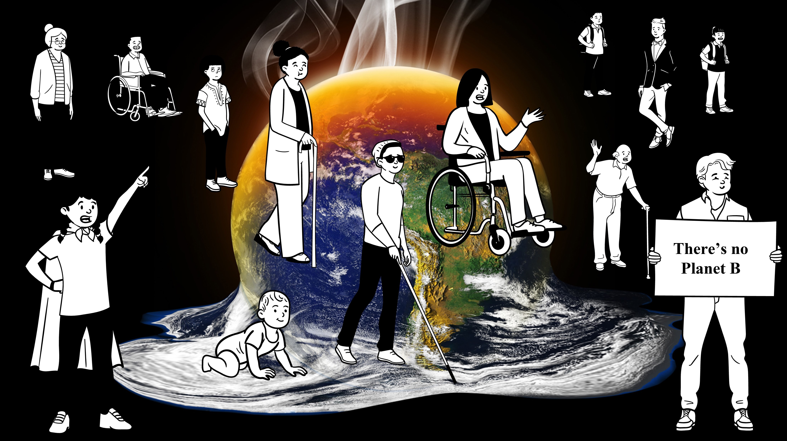

**Beszedics-Jäger B. Szimonetta** (PhD hallgató, Környezetgazdaságtan és Fenntartható Fejlődés Tanszék): A BME-GTK nemzetközi gazdálkodás alapszak elvégzése után a regionális és környezeti gazdaságtan mesterszakon folytattam tanulmányaimat. Miután megszereztem mesterdiplomámat, megkezdtem PhD tanulmányaimat. Jelenleg negyedéves vagyok a BME Környezetgazdaságtan és Fenntartható Fejlődés Tanszékén, kutatási témám a városi átalakulások elemzése a fenntarthatóság és klíma-alkalmazkodás kapcsolatrendszerében

**Bozsoki Fruzsina** (PhD hallgató, Környezetgazdaságtan és Fenntartható Fejlődés Tanszék): A BME-VBK környezetmérnök alapszak elvégzése után a regionális és környezeti gazdaságtan mesterszakon folytattam tanulmányaimat. Miután megszereztem mesterdiplomámat, megkezdtem PhD tanulmányaimat. Jelenleg harmadéves vagyok a BME Környezetgazdaságtan és Fenntartható Fejlődés Tanszékén, kutatási témám a barnamezős területek revitalizációs megoldásainak vizsgálata fenntarthatósági szempontból, továbbá ehhez kacsolódóan a városi élhetőség vizsgálata.

Klímaváltozás, alkalmazkodás, mitigáció és fenntarthatóság. Népszerű fogalmak, de vajon mit takarnak? Mind kapcsolódik a sikeres városfejlesztési folyamathoz, ami az ott lakók élhetőségének javítását célozza meg, és Te is részese vagy.

