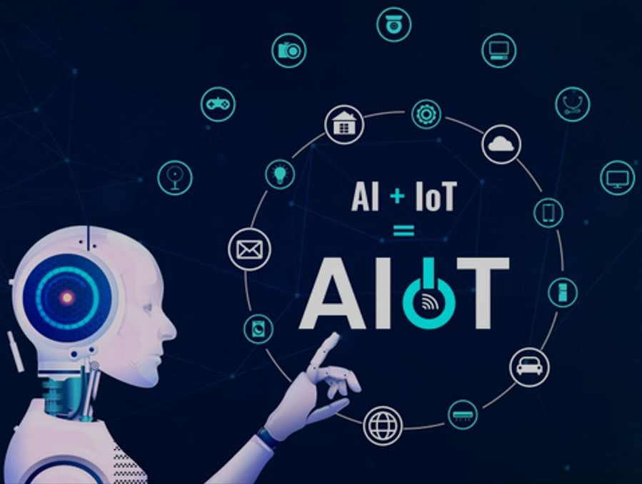

**Dr. Varga Pál** a BME oktatójaként Infokommunikáció tanít villamosmérnök hallgatóknak és Információs Rendszerek Üzemeltetését a mérnök informatikus hallgatóknak. Előadásokat tart az „IoT keretrendszerek és ipari alkalmazások”, „5G mobil rendszerek architektúrája és szolgáltatásai” és Alkalmazott Mesterséges Intelligencia modellek a gyakorlatban” témákban a BSc és MSc hallgatók számára, valamint „5G hálózatok, szolgáltatások és azok szinergiái az IoT-val” témában a PhD hallgatók számára. Fő kutatási területe a forgalomelemzés és modellezés, a hardveres gyorsítás, a hálózati teljesítmény mérése, a hálózat- és szolgáltatás-menedzsment, a hibák lokalizálása, a forgalom osztályozása, végponttól végpontig terjedő QoS, QoE és SLA kérdések, 100 Gigabites Ethernet, DDoS, szolgáltatásorientált architektúrák, az ipari IoT és blockchain, a mesterséges intelligenciához köthető technológiák alkalmazása, és a különböző rendszerek átjárhatóságának vizsgálata.

Vajon mire tudják használni a tárgyak az internetet, és az adatfeldolgozásban hogyan segít a Mesterséges Intelligencia? Hogyan lesz az emberek élete biztonságosabb, kényelmesebb, egyszerűbb, ha a környezetünkben lévő eszközök elkezdenek egymással kommunikálni? A verseny döntőjén kiderül a demonstrációkból és előadásokból!

