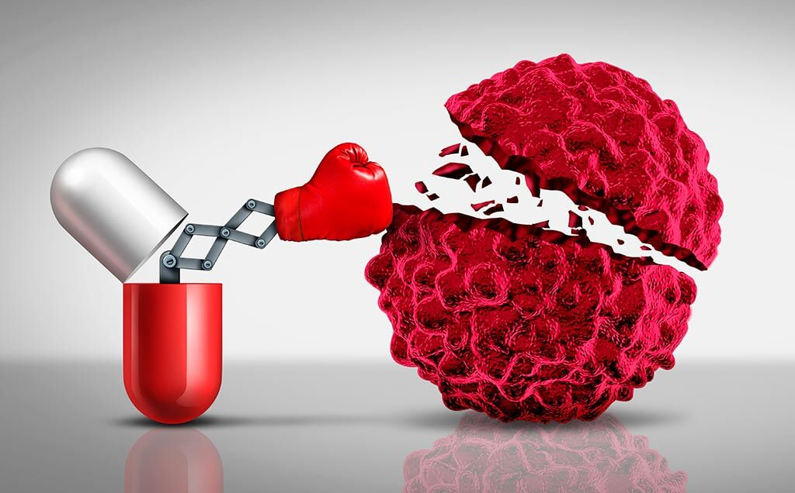

[**Keglevich András**](https://tudprog.bme.hu/kutatok_ejszakaja/profilok/keglevich_andras): 2014-ben vegyészmérnök BSc (gyógyszeripari szakirány), 2016-ban gyógyszervegyész-mérnöki MSc diplomát, 2021-ben PhD-fokozatot szereztem a BME VBK Szerves Kémia és Technológia Tanszék Alkaloidkémiai kutatócsoportjában, [Dr. Hazai László](https://oct.bme.hu/oct/hu/hazai) témavezetésével.
Kutatási tevékenységsem során a kutatócsoport hagyományait követve daganatellenes hatású természetes szerves anyagok szintézisével és az új származékok in vitro biológiai hatásvizsgálatával foglalkoztam. 2020 óta a gyógyszeriparban dolgozom, a Chiesi Hungary Kft. orvostudományi tanácsadójaként elsősorban tüdőgyógyászattal (asztma, illetve COPD) kapcsolatos klinikai vizsgálatok tervezésével és megvalósításával foglalkozom. A BME-VBK tiszteletbeli oktatójaként 2 éven keresztül részt vettem a Gyógyszerkémia tantárgy oktatásában biotechnológus hallgatók számára. 

[**Dr. Hazai László**](https://tudprog.bme.hu/kutatok_ejszakaja/profilok/hazai_laszlo): 1970-ben kaptam vegyészmérnöki oklevelet a BME Vegyészmérnöki Karán, 1971-1991 a MTA Kísérleti Orvostudományi Kutató Intézetben dolgoztam, majd 1991-ben kerültem a BME-re, ahol jelenleg a Szerves Kémia és Technológia Tanszék egyetemi magántanára vagyok. 1981-ben megszereztem a kémiai tudomány kandidátusa, 1991-ben pedig a kémiai tudomány doktora fokozatot. Kutatási témám: biológiailag aktív természetes anyagok kémiája. Oktatási feladataim: Biomolekulák kémiája előadás és laboratóriumi oktatás. 2008-ban oktatói és pedagógiai munkámért Görög Jenő díjat, 2009-ben pedig a tudományos pályafutásom elismeréseként Zemplén Géza díjat kaptam. 2010 óta már több alkalommal, legutóbb 2022-ben a hallgatók szavazatai alapján a Műegyetem 100 legjobb oktatója közé kerültem.

A rák napjaink egyik meghatározó egészségügyi problémája. Emiatt sajnos mindenki érintett a témában valamilyen formában. Az Élet és Tudomány ismeretterjesztő folyóiratban 2021-ben megjelent háromrészes cikksorozatunk összefoglalásaként előadásunkban megpróbálunk átfogó  képet adni arról, mit tudunk jelenleg az ilyen típusú megbetegedésekről, diagnosztizálásukról, gyógyítási lehetőségekről, és arról, milyen reményeket csillantanak fel és milyen irányban haladnak a legújabb kutatások.

