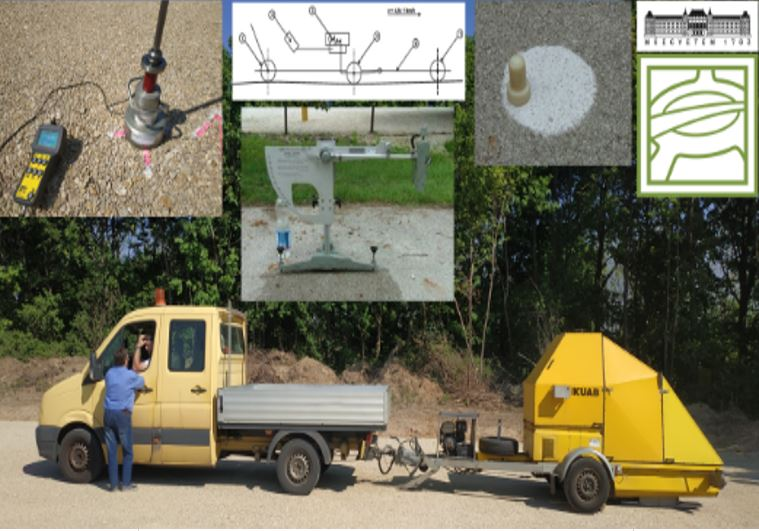

[Vattai Alina](https://epito.bme.hu/vattai-alina), [Balog László](https://epito.bme.hu/balog-laszlo)

A hallgatóság - életkorának megfelelő - bevonásával az aszfalt pályaszerkezet felületi egyenetlenségének mérése 4 méter hosszú "biciklivel"; teherbírásmérés félautomata és kézi módszerekkel; felületi érdesség mérése homokgyönggyel, csúszási ellenállás mérése.

