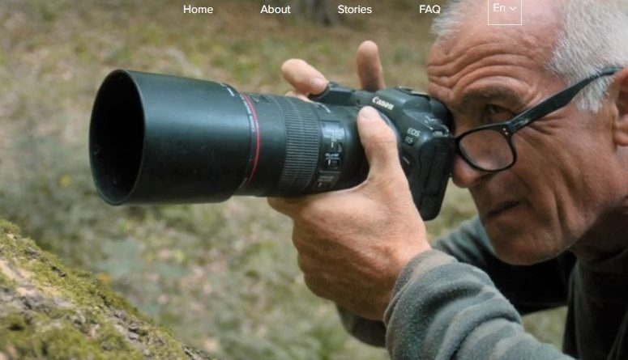

**Vincze Bálint** természetfotós. Munkáiban az ember által épített környezet és az állatvilág kölcsönhatását, együttélését jeleníti meg.

Vincze Bálint 15 éve kezdte el a természetfotózást. A majd két évtizede tartó természetfotózásai során Bálint eljutott Lappföldre, a Mikulás és a rénszarvasok varázslatos régiójába. Bálint négy fotóalbum szerzője is, és az egyik nagy közönségkedvenc az Ürge mese, amelyből hangoskönyv és audiovizuális változat is készült. Munkái sorra szerepelnek rangos hazai és külföldi pályázatokon, amelyekért Bálint több elismerést kapott már az évek alatt. Az egyik spanyolországi versenyen például egyszerre két kategóriában nyerte el az első díjat. Joggal merül fel a kérdés: Hogyan került Vincze Bálint természetfotós előadása a matematika, fizika és atomenergetika előadások közé? Ezt a kérdést azoknak válaszolja meg, akik eljönnek megnézni, meghallgatni előadását!

