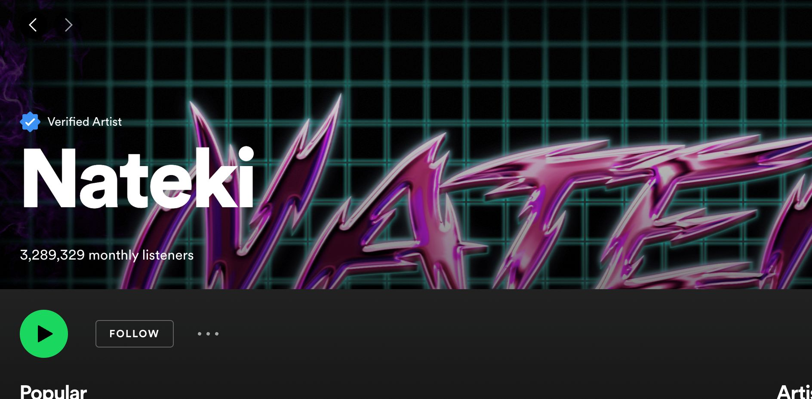

[Tófalvy Tamás](https://sites.google.com/site/tofalvytamas/) médiakutató, a BME Szociológia és Kommunikáció Tanszékének docense. Többek között a populáris zenei műfajok, közösségek és az internet kapcsolatát kutatja. Könyvei, írásai ingyenesen letölthetők a [tofalvytamas.hu](https://sites.google.com/site/tofalvytamas/) oldalról. 

Kik a legnépszerűbb nemzetközi és magyar előadók a digitális streaming platformokon itthon és külföldön, melyek a leghallgatottabb dalok, globálisan és Magyarországon? Mit árul el Azahriah, a Bagossy Brothers Company és a hirtelen feltűnt Nateki népszerűsége a magyarok online zenefogyasztási szokásairól? Többek között ezekre a kérdésekre ad választ az előadás a Spotify-ról és a YouTube-ról letöltött, a 2019. február 7-i és 2023. március 2-ai hét közötti heti top100 dalt tartalmazó toplisták elemzése alapján. Az előadás az NMHH számára készített friss, [2023-as tanulmány](https://onlineplatformok.hu/files/b92235b0-8169-4a1c-a53e-c1bd1c6e7338.pdf) alapján mutatja be a globális és magyarországi zenefogyasztás és zenei ízlés legfontosabb trendjeit, összefüggéseit.

