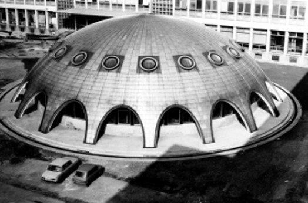

[Zsíros Gábor](http://www.reak.bme.hu/munkatars/oktatok/zsiros-gabor.html), [BME NTI Oktatóreaktor személyzet](http://www.reak.bme.hu/oktatoreaktor/reaktorlatogatas.html)

A BME Nukleáris Technikai Intézet Oktatóreaktorának megtekintése. Rövid, kb. fél órás előadás ismerteti a reaktor működésének fizikai alapjait. Ezután megmutatjuk a reaktorépület egyes részeit, működési funkcióit.

**A belépés feltétele a betöltött 16 év! A sugárvédelmi szabályok miatt terhes nők nem léphetnek be!** A reaktorlátogatási program regisztráció-köteles!

