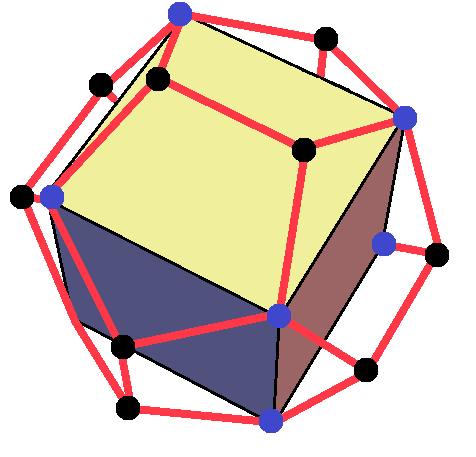

**Tasnádi Tamás** az ELTE fizikus szakán végzett majd, ugyanitt szerezte meg a PhD. fokozatot. Érdeklődése fokozatosan a matematika felé fordult, jelenleg a BME Analízis és Operációkutatás Tanszékén oktat főként analízist és funkcionálanalízist. Rendszeresen tart matematikai és fizikai tárgyú népszerűsítő előadásokat.

A szabályos és kevésbé szabályos sík lapokkal határolt testek (poliéderek) már az ókortól kezdve lenyűgözték a tudósokat. Az öt szabályos, ún. platóni test szerepet kapott naiv világmagyarázatokban is. Mitől szabályosak a platóni testek? Vajon Arkhimédész ismerte a focilabdát? Milyenek az arkhimédészi és a Catalán testek? Hogyan néznek ki a Kepler-Poinsot csillagtestek? Hogyan néz ki az átló nélküli Császár-féle test, és duálisa, a Szilassi-poliéder? Az előadás során ilyen és ehhez hasonló kérdéseket tárgyalunk meg, miközben rengeteg érdekes poliéder makettjét a kezünkbe is vehetjük.

