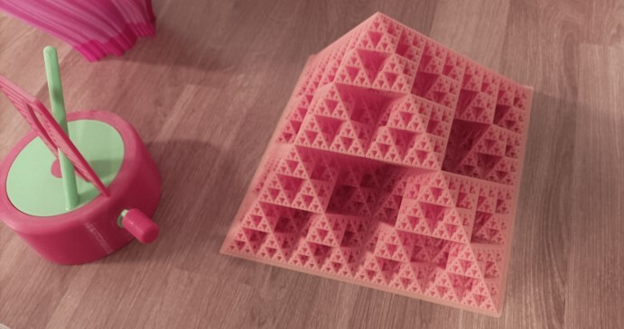

**Eper Miklós** a BME TTK matematikus szakon végzett, jelenleg doktorandusz hallgató. A különböző tudománynépszerűsítő programok lelkes szervezője, szereplője.

A látogatók érdekes feladatokon keresztül próbára tehetik magukat. Új ismereteket szerezhetnek a matematika különböző területeiről a lelkes matematikus hallgatóktól. 

