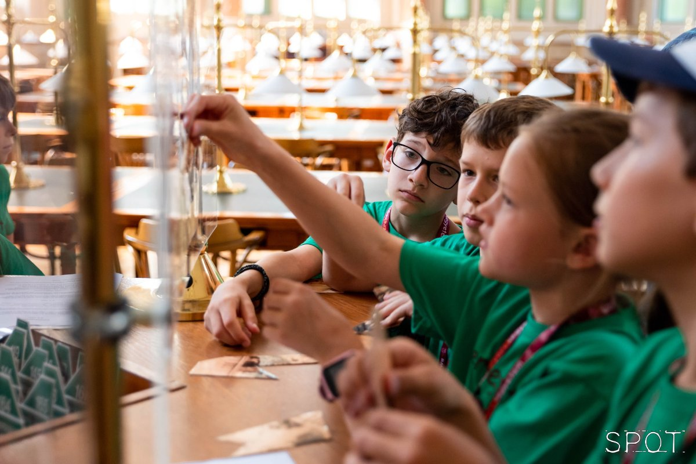

A gyerekek különböző feladatokon keresztül járják be a könyvtárat, ahol minden olvasóterem újabb nyomot rejt, így megismerve az épületet. Kisebb csoportban együtt oldják meg a feladatokat, melynek végén a kis felfedezők ajándékban részesülnek. A foglalkozás 8-10 éves gyerekeknek számára, felügyelet mellett zajlik. 

Megkérjük a szülőket, hogy a program alatt az aulában tartózkodjanak, vagy érdemes addig más programjainkon is részt venni. Szülők számára ajánljuk a Könyvtártúra és Padlástúra a könyvtárban programjainkat.

