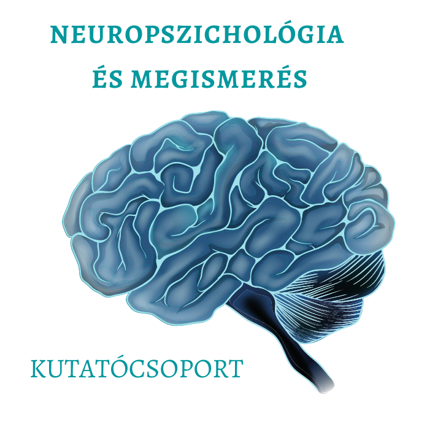

**Dr. Demeter Gyula** több éve vesz részt neuropszichiátriai és neuropszichológiai kutatásokban és tart kurzusokat különböző neuropszichológia témákban a BME Kognitív Tanszékének oktatójaként.  Neuropszichológusként az OMINT-OORI Agysérültek Rehabilitációs Osztályán agysérült betegek rehabilitációjában vesz részt. 

Előadásom betekintést nyújt a memória működésének rejtélyes világába, válaszokat adva arra a kérdésre, hogy milyen az emlékezés agysérülés után. Mindenkinek ajánljuk, aki szeret rácsodálkozni az emberi agy és emlékezet elképesztően összetett működésére.

