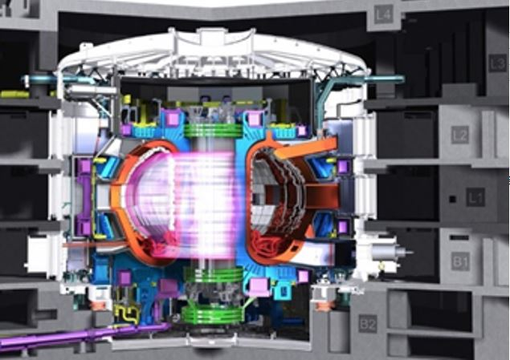

**Asztalos Őrs**: Adjunktus a NTI-ben, a Magyar Nukleáris Társaság Fúziós Szakcsoportjának az elnöke

Az energiaigény növekedésével, és a fosszilis energiahordozók végességének tudatával az emberiség komoly kihívások elé néz energetikai téren. Az egyik lehetséges megoldás az úgynevezett magfúzió, az a folyamat, amellyel a csillagok termelik az energiát, így a mi Napunk is.

