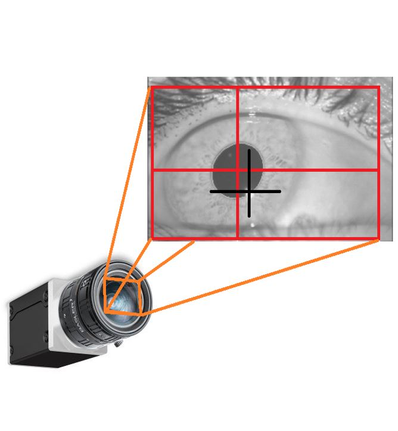

**Bényei Gábor**: Másodéves doktorandusz vagyok, a Figyelem és Emlékezet Kutatócsoport tagjaként érdeklődésem középpontjában a végrehajtó funkciók mögött álló folyamatok szemmozgás-követéssel történő vizsgálata áll. Kutatómunkám során a pupillometriai adatfeldolgozás lehetőséget is igyekszem feltárni. Emellett közreműködöm a PupilEXT nevű nyílt-forrású szemmozgáskövető rendszer fejlesztésében.

Előadásomon a résztvevők megismerkedhetnek a szemmozgáskövetés módszereivel, a pupilla és tekintet követésének történetével, elméleti hátterével, illetve szoftveres és hardveres lehetőségeivel, korlátaival.

