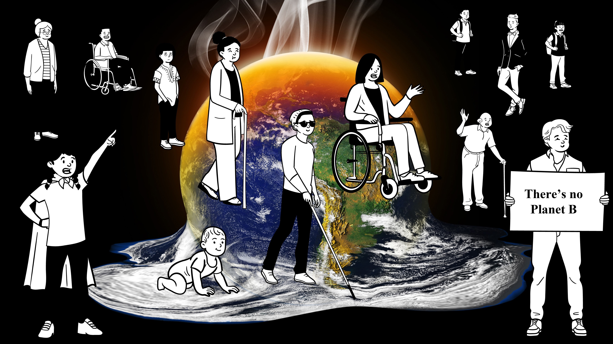

**Buzási Attila** (tanszékvezető, egyetemi docens): a Környezetgazdaságtan és Fenntartható Fejlődés Tanszék tanszékvezetője, végzettségét tekintve környezetmérnök és regionális és környezeti gazdaságtan diplomákkal rendelkezik. Kutatási területe a klímaváltozáshoz való alkalmazkodás és a fenntarthatóság kapcsolatrendszere, különös tekintettel a városi területekre és a regionális különbségekre. Számos nemzetközi publikáció szerzője, emellett nagy sikerrel oktatja "Klímaváltozásról - mesterfokon" című tantárgyát, mely a Műegyetem első, célzottan a klímaváltozással foglalkozó kurzusa volt. A klímaváltozással kapcsolatban különösen érdekli a hőhullámokhoz való alkalmazkodás, mely a hazai városok egyik legfontosabb kihívásai közé tartozik, ahogy azt látjuk és érezzük is évről évre.

Felkészült-e Budapest a klímaváltozás által kiváltott egyre gyakoribb és erőteljesebb hőhullámokra? Hol találhatók a legforróbb pontok, mely kerületek a leginkább sérülékenyek és vajon megfelelő stratégiákkal rendelkezünk? 

