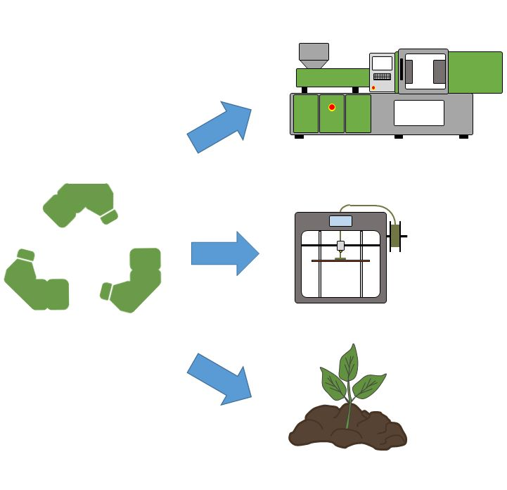

[Dr. Gere Dániel](http://www.pt.bme.hu/munkatarsadatlap.php?id=kb45kox2hu4xxz4jn8u627pwn3ok78975d9exw6c&l=m) 2017 óta dolgozik a Budapesti Műszaki és Gazdaságtudományi Egyetem, Gépészmérnöki Karának Polimertechnika Tanszékén, 2022-től adjunktusként, emellett a tanszék környezetvédelmi felelőseként. Kutatási területe kiterjed a műanyagok mechanikai újrahasznosítására, valamint a biológiailag lebontható műanyagok komposztálhatóságára is. Emellett alapanyagok fejlesztésével, ezek feldolgozhatóságával és vizsgálatával is foglalkozik. Részt vesz több ipari K+F fejlesztési projektben is.

[Kovács Zsófia](http://www.pt.bme.hu/munkatarsadatlap.php?id=ek4b3z8s865j5u2c45A79qo25wm5z8Ag4A2jcubz&l=m), [Kohári Andrea](http://www.pt.bme.hu/munkatarsadatlap.php?id=72s794mv2u2s4334p785un64x2xk2g6j2fhum2h5&l=m),
[Görbe Ákos](http://www.pt.bme.hu/munkatarsadatlap.php?id=8z5tj52s7Bt2cB6k55c737672ybk829774gc2rd9&l=m), [Varga László József](http://www.pt.bme.hu/munkatarsadatlap.php?id=9t28uf5cvB26vv649pg8dgu327494ex4mxdp6v9u&l=m)

Az esemény során a látogatók megismerkedhetnek a műanyagok mechanikai újrahasznosításának lépéseivel, láthatják, hogy milyen termékek készülhetnek az összegyűjtött szelektív hulladékból. Emellett a látogatók átfogó képet kaphatnak a biopolimerekről, illetve ezek komposztálhatóságáról.  A program kapcsolódik a Polimertechnika Tanszék MT épületi laboratóriumában "Kompozit 3D nyomtatás: játékszer vagy a jövő?" címmel megrendezésre kerülő programhoz.

