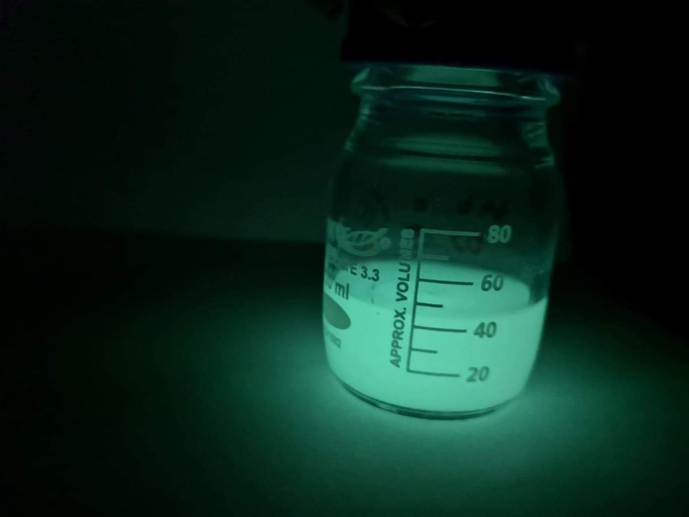

**Dr. Feigl Viktória Dóra**: Biomérnök, egyetemi docens, szakterülete a környezettoxikológia, a környezeti mikrobiológia és a szennyezett talajok és hulladékok kezelése biotechnológiákkal.

**Berkl Zsófia**: Környezetmérnök, doktorjelölt, kutatási témája a baktériumok közötti kommunikáció vizsgálata.

**Márton Rita**: Biomérnök, PhD hallgató, kutatási témája a mikroszkópikus gombák közötti kommunikáció vizsgálata.

Hogyan szabadul ki a világító baktérium a sötét szobából? Hogyan szól a gomba a haverjának? Mit csinál az egysejtű vagy a bolharák, ha jóllakott? Gyere, és ismerd meg a BME környezeti mikrobiológia és környezettoxikológia laboratoriumának titkait!

_Érkezéskor kérjük az üvegajtó előtt várakozni!_

