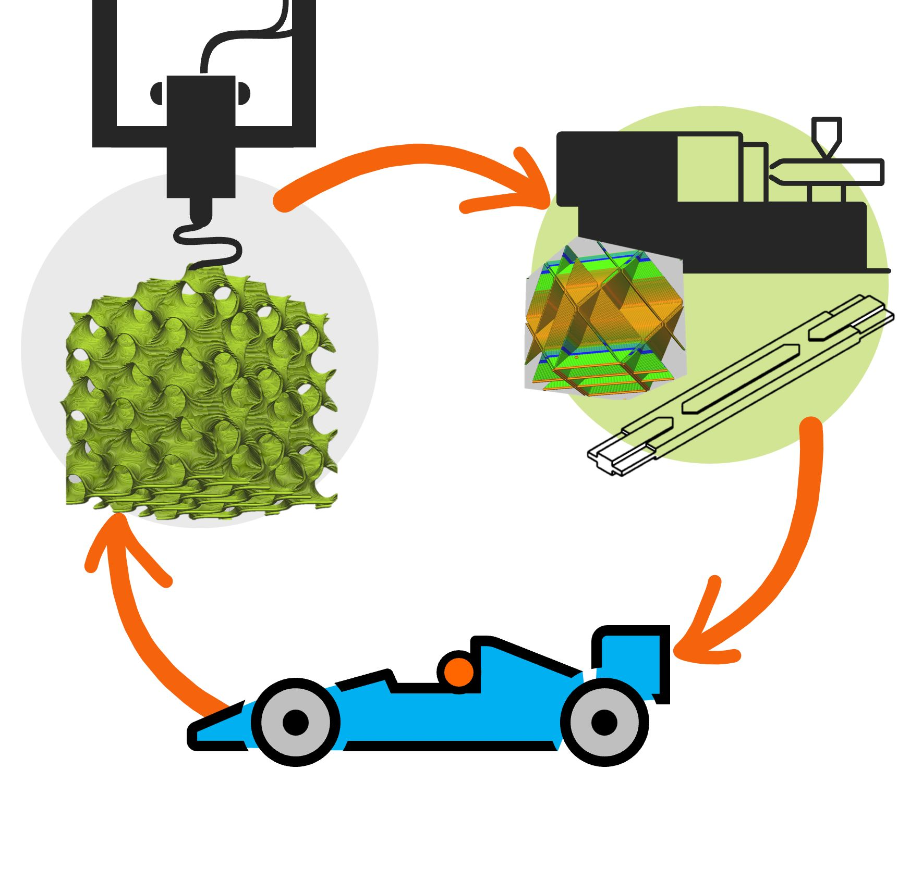

[Dr. Kovács Norbert Krisztián](http://www.pt.bme.hu/munkatarsadatlap.php?id=j2j3e454q78eqxmsstuvb3639ho6B799bpp6kbh9&l=m) a Budapesti Műszaki és Gazdaságtudományi Egyetem Polimertechnika Tanszékén adjunktusként dolgozik. Gépészmérnöki diplomáját 2006-ban szerezte a BME- Gépészmérnöki karán, majd tanulmányait a Polimertechnika Tanszéken folytatva 2015-ben PhD fokozatot szerezett a „Prototípus fröccsöntő szerszámozás technológiájának fejlesztése” című dolgozatával. A doktori fokozat megszerzését követően kutatási tevékenységet tovább folytatta az additív gyártástechnológiák (3D nyomtatás) és azok kisszériás műanyag-alakító szerszámként való alkalmazhatóságának témakörében. A témában számos publikációja jelent meg nemzetközi és hazai folyóiratokban egyaránt. Nős, 2 gyermek édesapja.

[Tóth Csenge](http://www.pt.bme.hu/munkatarsadatlap.php?id=569w9t99crk8q539s9jA7kt4zh52mmt3789kjdB7&l=m), [Szederkényi Bence](http://www.pt.bme.hu/munkatarsadatlap.php?id=4983894m78A424976s2rBk5w9suym34rs3bp3jq7&l=m),
[Dr. Suplicz András](http://www.pt.bme.hu/munkatarsadatlap.php?id=Btv9mv8qxj57f62x498x7on36j78d22e4683yf76&l=m), [Dr. Török Dániel](http://www.pt.bme.hu/munkatarsadatlap.php?id=Bjpon4ek5oe8zjb274q46e75BB86q59p3574dA8o&l=m)

Az utóbbi évtizedekben a 3D nyomtatás egyre nagyobb teret hódít az otthoni és az ipari felhasználók körében egyaránt. Segítségével a tervező mérnökök olyan alkatrészeket álmodhatnak meg, amelyek korábban csak több alkatrész összeszerelésével voltak megvalósíthatók. Ennek köszönhetően energiát és alapanyagokat lehet megspórolni, ami jelentősen hozzájárul, hogy az adott termék ökológiai lábnyomát csökkenteni tudják. Az utóbbi években a kompozit alapanyagok megjelenése ezen a területen újabb lendületet hozott, mind a felhasználói körök bővülése, mind a fejlesztések tekintetében. A laborlátogatás során a résztvevők megismerhetik a különböző 3D nyomtatási módszereket, kiemelten foglalkozunk a kompozit 3D nyomtatással és bemutatjuk a területhez kapcsolódó legújabb innovációkat (kutatásokat). A program kapcsolódik a Polimertechnika Tanszék MT épületi laboratóriumában " Hozz magaddal 10 kupakot és hasznosítsuk újra együtt!" és a „Kompozit szendvics szerkezetek - itt nem az íz számít”  címmel megrendezésre kerülő programokhoz.

 **Az egyes labortevékenységek bizonyos esetekben erősebb szag- és hanghatással járhatnak.** 
 

