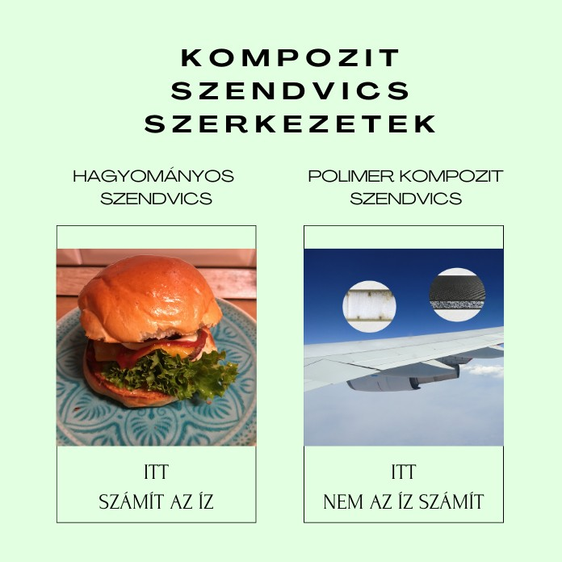

[Dr. Tamás-Bényei Péter](http://www.pt.bme.hu/munkatarsadatlap.php?id=25B9ug9m48B6A987r5q2343q99nw9rb7m3n3qwh2&l=m) 2012 óta dolgozik a Budapesti Műszaki és Gazdaságtudományi Egyetem, Gépészmérnöki Karának Polimertechnika Tanszékén, 2014-től adjunktusként, emellett 2012 óta a HUN-REN-BME Kompozittechnológiai Kutatócsoport tudományos főmunkatársaként. Kutatási területe kiterjed a szálerősített kompozitok anyagok és gyártástechnológiák fejlesztésére. Emellett a polimer kompozitok és szendvicsszerkezetek jellemzőinek vizsgálatával és viselkedésük elemzésével is foglalkozik, valamint újrahasznosításával. Részt vesz több ipari K+F fejlesztési projektben is. Nős, 3 gyermek édesapja.  

[Dr. Czél Gergely](http://www.pt.bme.hu/munkatarsadatlap.php?id=m2u96285n263k69972655k9B37gmduggs44fnc47&l=m), [Dr. Pomázi Ákos](http://www.pt.bme.hu/munkatarsadatlap.php?id=8h6v84sgb4ft76gc23zBh5Aruux9w4B277eh9jhv&l=m),
[Sántha Péter](http://www.pt.bme.hu/munkatarsadatlap.php?id=qj2v38xjBBe75ve8s8bA2ukv8zAf2j29ej44232t&l=m), [Marton Gergő Zsolt](http://www.pt.bme.hu/munkatarsadatlap.php?id=vAjt37cAup89s55B6Apdcr6A43723shxqw4v7685&l=m)

Napjainkban a high-tech eszközök szinte kivétel nélkül tartalmaznak polimer kompozitokat, mivel alkalmazásukkal érhető el az a fajta nagy teljesítmény, ami megkülönbözteti őket a társaitól. Abban az esetben, amikor még nagyobb teherviselő képességre van szükség, akkor kerülnek látómezőbe a szendvics szerkezetek, amelyek felhasználásával drasztikusan növelhető a hajlítómerevség a tömeg alacsonyan tartása mellett. A laborlátogatás során a résztvevők megismerhetnek a repülőgépiparban és a Forma-1-ben is alkalmazott legkorszerűbb polimer kompozit anyagokkal, gyártástechnológiákkal és vizsgálati módszerekkel. Tapasztalatokat szerezhetnek az újrahasznosított szénszálakkal kapcsolatban is.  A program kapcsolódik a Polimertechnika Tanszék T épületi laboratóriumában "Mikroszkóp-Mikroszál; kompozit erősítőanyagok és vizsgálatuk"  címmel megrendezésre kerülő programhoz és laborlátogatáshoz.

**Az egyes labortevékenységek bizonyos esetekben erősebb szag- és hanghatással járhatnak.**

