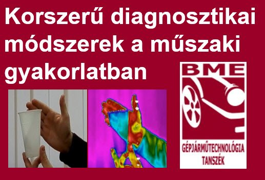

**Dr. Hlinka József**: A Budapesti Műszaki és Gazdaságtudományi Egyetem Közlekedésmérnöki és Járműmérnöki Karának [Gépjárműtechnológia Tanszékén](https://auto.bme.hu/) egyetemi adjunktusként dolgozik. Az egyetemen oktató és kutató munkát végez. 

A korszerű diagnosztika területéről bemutatjuk a gyorskamerás, hőkamerás és endoszkópos vizsgálatok eszközeit és példákat alkalmazási lehetőségeikről. A hőkamerás vizsgálatok esetében a szemünk számára láthatatlan elektromágneses sugárzásokat vizsgáljuk.

