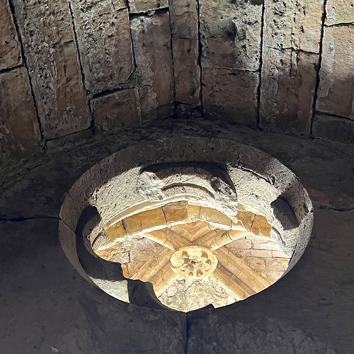

**Prof. Vasáros Zsolt DLA** építész a BME Exploratív Építészeti Tanszék, és a HAMT (Hungarian Archaeological Mission in Thebes, South Khokha Project ELTE és BME Budapest) vezetője, egyetemi tanár. Az [egyetemi oktatás](www.explo.bme.hu) mellett [saját építészeti praxisában](www.narmer.hu) alkot. Az egyetemi oktatást szervesen egészítik ki az általa vezetett, illetve aktív részvételével folytatott kutatások Egyiptomban, Szíriában és Mexikóban.

Földrengés Mexikóban, robban(t)ás Libanonban, háború és földrengés Szíriában és „sírrablás” Egyiptomban. Beszámoló az Exploratív Építészeti Tanszék természeti csapásokhoz ill. emberek által előidézett krízishelyzetekhez kapcsolódó interdiszciplináris kutatásairól

