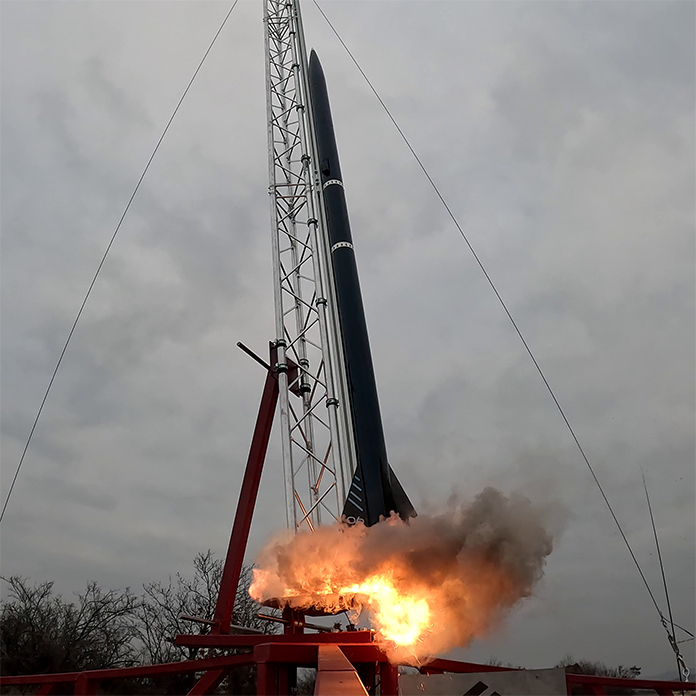

**Illyés András:** mechatronikai mérnök, a kutatórakéták szerelmese, a BME Aerospace Team vezetője

**Princz Katalin:** közgazdász, a BME Aerospace marketing menedzsere

A tudomány területén különleges helyet foglalnak el a kutatórakéták. Tudtad, hogy a BME-n is építenek ilyet? A BME Aerospace Team szuperszonikus, szuborbitális kutatórakéták építésével foglalkozik, melyek közül egyet az est keretein belül testközelből is meg lehet tekinteni.

