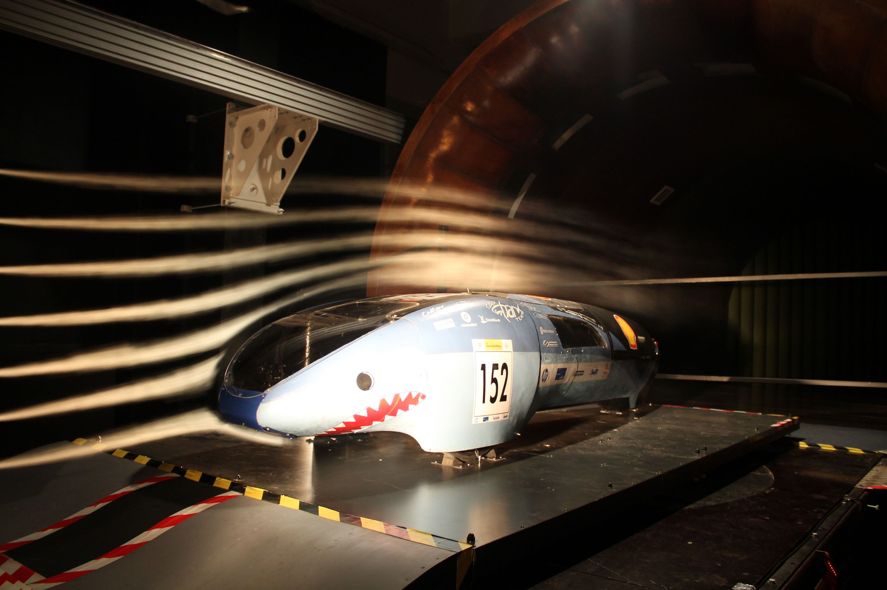

[Tokaji Kristóf](https://www.ara.bme.hu/munkatarsak/552) okl. gépészmérnök (MSc), áramlástechnikai gépészmérnök, tanszéki mérnök az Áramlástan Tanszék munkatársa. Kutatási területei: aerokausztika, áramlások modellezése, áramlástechnikai gépek, légtechnika. 

[Információk a Áramlástan Tanszékről>>](https://www.ara.bme.hu/) 

[Információk a Áramlástan Szakosztályról>>](https://www.facebook.com/aramlastanszakosztaly)

Megismerkedhetnek a szélcsatornás mérésekkel és érdekes áramlástani sajátosságokkal. Lehetőség van beállni a szélcsatorna közel 90 km/h sebességű levegőáramába. Továbbá látványos áramlástani bemutatók tekinthetők meg.

