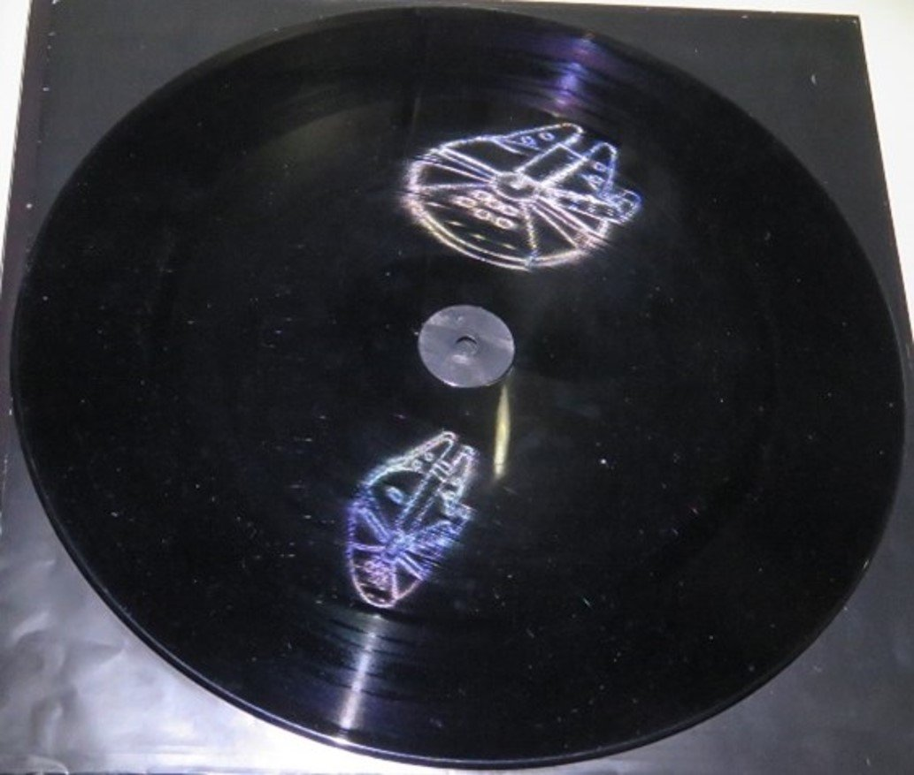

[Dr. Bokor Nándor](https://dept.physics.bme.hu/Bokor_Nandor)

Kicsiket és nagyokat egyaránt szeretettel várunk, hogy megismerkedjenek látványos érdekességekkel az optika világából. Olyan, a nagyközönség számára talán kevéssé ismert jelenségeket mutatunk be mint a moiré-hatás, karcholográfia, varázstükrök, kausztikus leképezés, integrált fényképezés, fluoreszcencia, optikai aktivitás, száloptikai nagyítás.

