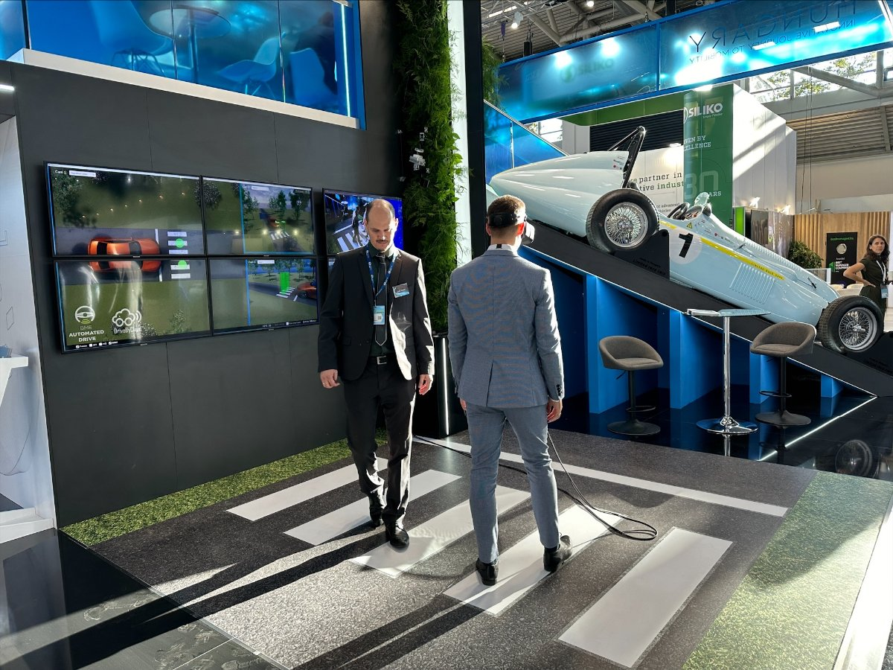

**Dr. Rövid András**: A Budapesti Műszaki és Gazdaságtudományi Egyetem, Közlekedésmérnöki és Járműmérnöki Kar, Gépjárműtechnológia Tanszék tudományos főmunkatársa. A Környezetérzékelés kutatócsoport vezetője
tématerület: gépi látás, képfeldogozás, nyers szenzor fúzió

**Vincze Zsolt**: A Budapesti Műszaki és Gazdaságtudományi Egyetem, Közlekedésmérnöki és Járműmérnöki Kar, Gépjárműtechnológia Tanszék tudományos segédmunkatársa, PhD hallgató. Tématerület: Szenzor szinergiákon alapuló intelligens környezetérzékelési módszerek az autonóm közlekedés támogatására
Kutatócsoport: Környezetérzékelés

**Cserni Márton**: A Budapesti Műszaki és Gazdaságtudományi Egyetem, Közlekedésmérnöki és Járműmérnöki Kar, Gépjárműtechnológia Tanszék PhD hallgatója.  Tmaterület: Kamera alapú 3D érzékelés az önvezetés támogatására
Kutatócsoport: Környezetérzékelés

**Fodor Károly**: A Budapesti Műszaki és Gazdaságtudományi Egyetem, Közlekedésmérnöki és Járműmérnöki Kar, Gépjárműtechnológia Tanszék PhD hallgatója.
Tématerület: Kooperatív vSLAM módszerek a könyezetérzékelés támogatására
Kutatócsoport: Környezetérzékelés

A látogatók megszemlélhetik hogyan működik egy több szenzorállomást tartalmazó központi érzékelő rendszer, mely a detektált objektumokat kiterjesztett valóság segítségével vizualizálja.

