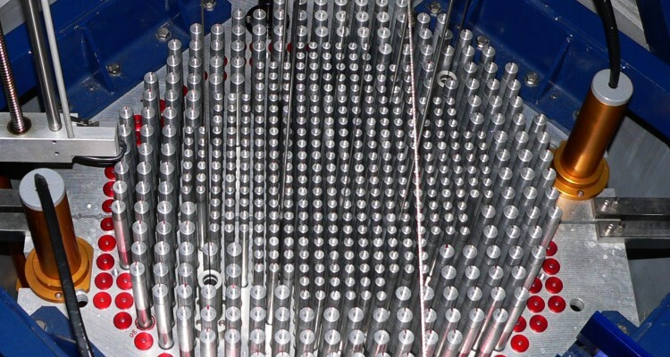

[**Aszódi Attila**](https://hu.wikipedia.org/wiki/Asz%C3%B3di_Attila) a BME TTK Dékánja, nukleáris energetikai szakember, volt államtitkár, kormánybiztos. A fukusimai atomerőmű-baleset után 2011. december – 2012. április között az Európai Bizottság Európai atomerőművek Célzott Biztonsági Felülvizsgálata projektjének (az ún. Stressz-tesztnek) szakértőjeként dolgozott. 

Középiskolában mindenkinek hallania kellene az atomerőművekről, és a működésükről. Ennek ellenére rengeteg tévhit, félreértés kering róla. Mit "égetünk" el az atomerőműben? Van-e kéménye az atomerőműnek?  Aszódi Attila tanárúr ezen az estén tart egy fizikaórát, és eloszlatja a tévhiteket és félreértéseket.

