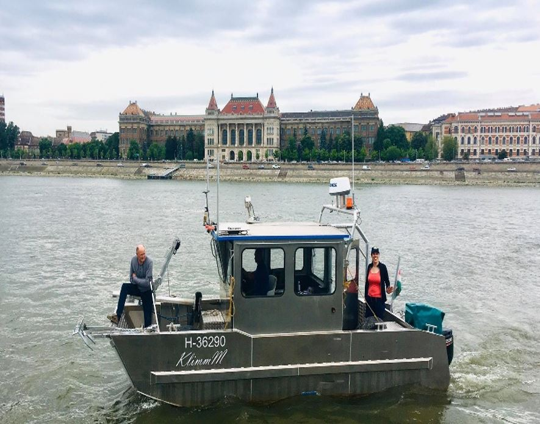

[Dr. Baranya Sándor](https://epito.bme.hu/baranya-sandor): A BME Vízépítési és Vízgazdálkodási Tanszék egyetemi docense, tanszékvezető.

**Kéri Barbara** és **Füstös Vivien** a a BME Építőmérnöki Kar, Vízépítési és Vízgazdálkodási Tanszék munkatársai.

Szeretsz a felszín alá nézni? Érdekel, milyen titkokat rejt Magyarország legnagyobb folyója, a fővárost kettészelő Duna? Csatlakozz hozzánk egy dunai csónakázásra a Műegyetem előtt! A programon bemutatjuk Neked, milyen műszerekkel tudják ma a vízmérnökök egy folyó fontos tulajdonságait megmérni; ezek közül néhány mérést el is végzünk; valamint egyebek mellett azt is elmeséljük, hogy mi köze lehetett (volna) József Attilának a vízsebesség-méréshez. Szeretettel várunk!

**A csónakban mentőmellény viselése szükséges**, amit biztosítunk. A vízi közlekedés jellegéből adódóan előfordulhat, hogy kevés víz befröcsköl a csónakba, de borulástól nem kell tartani.

