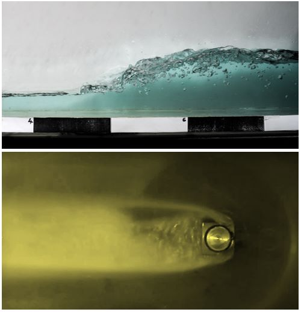

**Dr. Csizmadia Péter** okleveles gépészmérnök, Ph. D., jelenleg a HDR Tanszéken adjunktus pozícióban dolgozik. Fő szakterülete a nemnewtoni folyadékok vizsgálata áramlástechnikai gépek esetében. 

**Gulyás András** okleveles gépészmérnök (MSc), jelenleg laborvezetőként dolgzik a HDR Tanszéken. Fő szakterülete az áramlástani méréstechnika. 

**Sándor Levente Gábor** okleveles gépészmérnök (MSc), jelenleg doktoranduszként dolgozik a HDR Tanszéken. Fő kutatási területét a hemodinamikai kutatások (véráramlás) jelentik.

Mi a közös egy tönkrement hajócsavar és egy hangos vízforraló között? Hogyan alakul ki egy nyíltfelszínű hullám? Kísérleti berendezéseinken bemutatjuk ezen szép, de olykor pusztító erejű áramlástani jelenségeket.

Ezen kísérlet 10 év alatti gyermek számára nem látogató. Szíves figyelmükbe ajánljuk másik programunkat, amit ["Mindennapi áramlástan, kísérletek kicsiknek és nagyoknak"](https://tudprog.bme.hu/kutatok_ejszakaja/2023/mindennapi-aramlastan-kiserletek-kicsiknek-es-nagyoknak.html) címmel hirdetünk.

