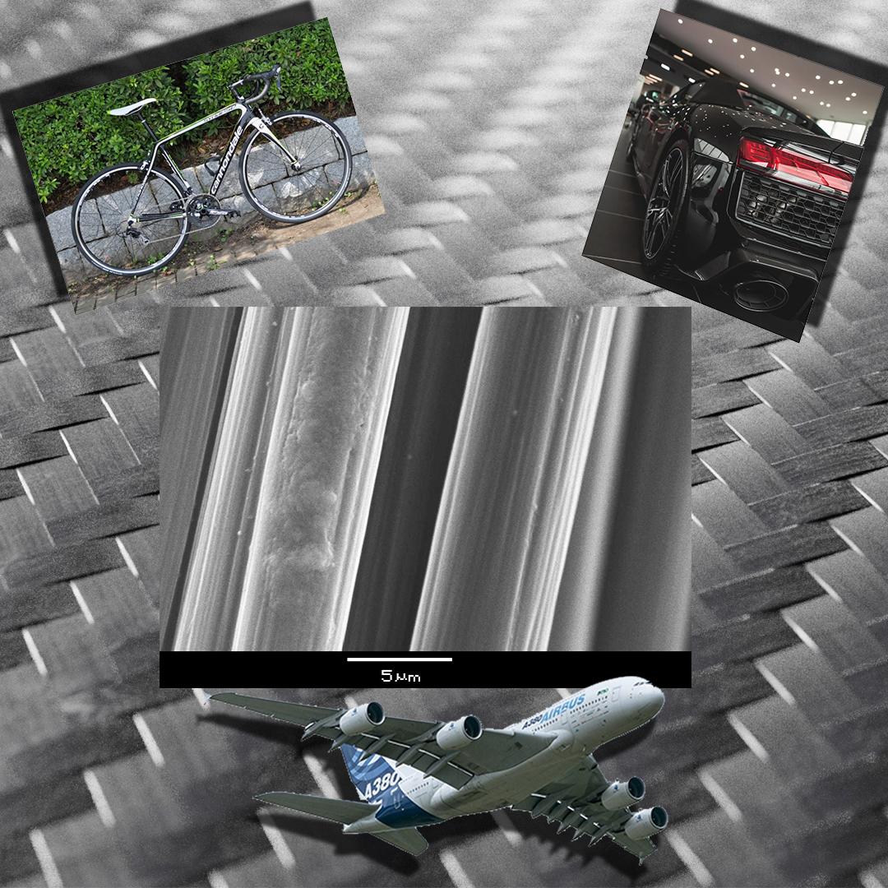

[Dr. Tamás-Bényei Péter](http://www.pt.bme.hu/munkatarsadatlap.php?id=25B9ug9m48B6A987r5q2343q99nw9rb7m3n3qwh2&l=m) 2012 óta dolgozik a Budapesti Műszaki és Gazdaságtudományi Egyetem, Gépészmérnöki Karának Polimertechnika Tanszékén, 2014-től adjunktusként, emellett 2012 óta a MTA-BME Kompozittechnológiai Kutatócsoport tudományos munkatársaként. Kutatási területe a szálerősített kompozitok anyagok és gyártástechnológiák fejlesztése, valamint a polimer kompozitok jellemzőinek vizsgálata. Emellett elasztomerek fejlesztésével és viselkedésük elemzésével is foglalkozik. Részt vesz több ipari K+F fejlesztési projektben is. Nős, 3 gyermek édesapja.

**Pinke Balázs**: Tanszéki Mérnök, Mikroszkópia és Morfológia Szaklaboratórium vezető.

Miért használnak polimer kompozitokat a repülőgépek, versenyautók, versenybiciklik gyártásánál? Miben tud többet (vagy éppen kevesebbet) a szénszál a fémeknél? Hogyan vizsgálják és mi alapján minősítik ezeket az erősítőanyagokat? Még csak a sorozatokban hallottál elektronmikroszkópról? Itt az idő, hogy ez megváltozzon! A program kapcsolódik a Polimertechnika Tanszék MT épületi laboratóriumában "Kompozit szendvics szerkezetek - itt nem az íz számít" címmel megrendezésre kerülő programhoz és laborlátogatáshoz.

