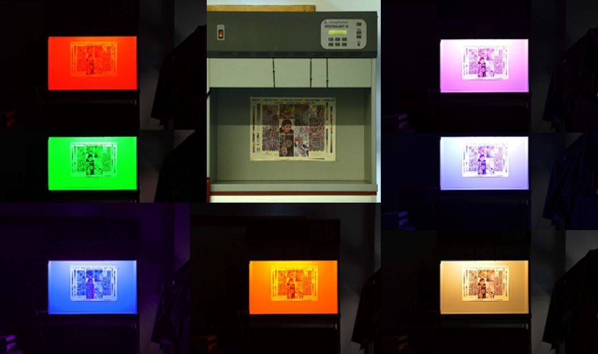

**Nagy Balázs Vince** a Mechatronika, Optika és Gépészeti Informatika Tanszék docense. Kutatási területe a műszaki optika, a színek fizikája, szubjektív észlelése.

**Urbin Ágnes** a Mechatronika, Optika és Gépészeti Informatika Tanszék adjunktusa. Kutatási területe a színlátás, azon belül a kromatikus adaptáció és hatásai.

Mi a szín? Hogyan változik a tárgyak színe különböző környezetekben? Mi történik a tárgyak színével, ha színes LED-ek fénye alatt nézzük őket? Keressük együtt a válaszokat a MOGI Tanszék optika laborjaiban, ahonnan érdekes kísérletekkel és vizsgálatokkal várjuk az édreklődőket.

