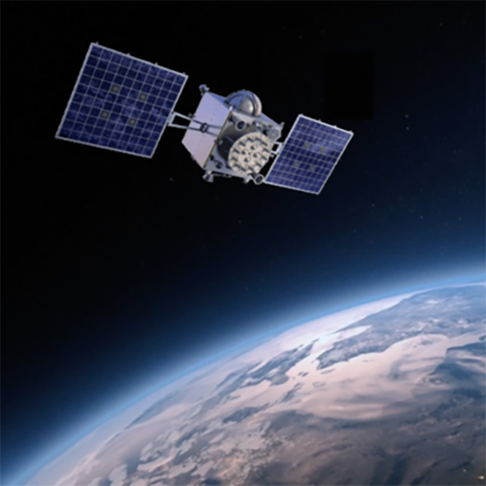

[Dr. Rózsa Szabolcs](http://geod.bme.hu/rozsa-szabolcs) szakterülete a nagypontosságú műholdas helymeghatározás és annak földtudományi alkalmazásai. Kutatási területe kiterjed a GNSS észlelések alapján végzett légköri vízpára vagy éppen az ionoszférában található szabad elektronok meghatározására. Az Általános és Felsőgeodézia Tanszék kutatócsoportjában ezen felül foglalkoznak még önvezető autók lokalizációjával, hidak deformációvizsgálatával vagy éppen a folyók vízszintjének meghatározásával a vízfelületről visszavert GPS jelek alapján.

**Ács Ágnes, Laky Piroska, Turák Bence, Farkas Márton, Hrutka Bence, Ambrus Bence, Tuchband Tamás, Siki Zoltán** és **Takács Bence** a a BME Építőmérnöki Kar, Általános és Felsőgeodézia Tanszékének munkatársai.

Hogyan működik a GPS? Rábízzuk-e az életünket a GPS pozíciókra? A GPS azt is tudja mennyi eső eshet vagy milyen vastag hótakaró fedi a Sziklás hegységet! GPS a hidak deformációmérésében. Előadással és gyakorlati bemutatóval várjuk az érdeklődőket!

