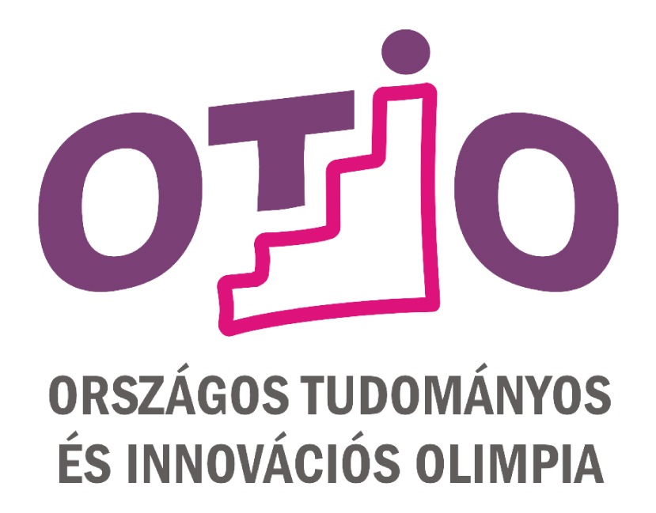

A Magyar Innovációs Szövetség elkötelezett a tehetséggondozás iránt, 32. éve bonyolítja le az [Országos Tudományos és Innovációs Olimpiát (OTIO)](http://www.otio.hu/). A 31 évig Országos Ifjúsági Tudományos és Innovációs Tehetségkutató Versenyként zajló megmérettetést 2022-ben újragondolt elemekkel és megváltozott struktúrában immár OTIO néven került megrendezésre. A bírálóbizottság munkájában való közreműködésre elismert tudósokat, akadémikusokat, egyetemi tanárokat és gazdasági szakembereket hívunk meg, az idei zsűriben a BME részéről Dr. Ekler Péter, Dr. Pap László és Dr. Tevesz Gábor is részt vett. A zsűri elnöki tisztét 2015 óta  Dr. Jakab László, a BME Villamosmérnöki és Informatikai Kar professzora tölti be.

Az OTIO egy természettudományt népszerűsítő projekt verseny. Középiskolások pályázhatnak önálló, innovatív alkotással, találmánnyal, kutató vagy fejlesztő, ill. tudományos munka eredményével.

