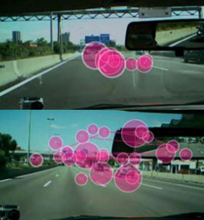

**Pajkossy Péter**: A BME Kognitív Tudomány Tanszékének adjunktusa, szakterülete az emlékezeti és figyelmi folyamatok vizsgálata.

A szemmozgáskövető berendezés segítségével rögzíthető, hova néz, mire figyel a felhasználó. Az előadásomban olyan kutatások ismertetünk, melyek a szemmozgáskövető segítségével vizsgálják az emlékezet és figyelem működését, agyi háttérfolyamatait.

