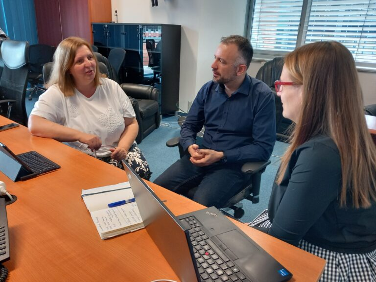

**Szereplők:**

[Grad-Gyenge Anikó](https://law.bme.hu/munkatarsaink), a BME GTK Üzleti Jog Tanszék docense, szerzői jogász,

[Szigetvári Andrea](https://lfze.hu/zeneszerzes-oktatok/szigetvari-andrea-1435), a LFZE docense, zeneszerző, 

[Dr. Forstner Bertalan](https://www.aut.bme.hu/Staff/cyberci), a BME VIK Automatizálási és Alkalmazott Informatikai Tanszékének docense. Bertalan gyakran szerepel innovatív és interdiszplicináris kutatási területek résztvevőjeként. Ilyen például a tanulás, pedagógia, pszichometria és biofeedback területeit összekapcsoló Tanulási Környezet Kutatócsoport. A jelenlegi esemény apropóját a BME által szervezett Művészeti Rezidens program adja, ahol a győztes pályamunka a zeneszerzés, mesterséges intelligencia és szerzői jog kapcsolatát feszegeti.

A program a BME Művészeti Rezidenciaprogramjának keretében jön létre. A közreműködők a zene és a mesterséges intelligencia egyes kapcsolódási pontjait vizsgálják. Úgy gondoljuk, hogy a művészet sosem fog megszűnni, mivel az emberi létezésben mélyen gyökerezik, hogy kreatív módon szeretnénk kifejezni magunkat. Ugyanakkor a mesterséges intelligencia hatására át fog alakulni, és úgy hisszük, az lesz a feladatunk, hogy nyomon kövessük ezt az átalakulást. 
Közös bennünk, hogy szeretünk interdiszciplináris témákon dolgozni, amelyek túlmutatnak egyetlen területen, pl. informatikán, zenén, jogon. Sosem tudhatjuk előre, hogy azokkal, akikkel együtt dolgozunk, milyen gondolkodásmódot hoznak magukkal, és hogyan gazdagíthatjuk egymást. Ez a közös munka egy folyamat, ami arról szól, hogy mindannyian tanulni fogunk egymástól. Programjaink látogatóinak is valószínűleg olyan friss, újszerű meglátásaik lesznek, amelyekre mi nem is gondoltunk, hiszen más környezetben nőttünk fel.

A mesterséges intelligencia által generált zene létrehozása számítógépes algoritmusokra támaszkodik. Bár a zenekedvelők sokszor úgy érzik, hogy az algoritmusok és a matematika szembeállíthatók a zenével, fontos megérteni, hogy a zene szabályai és struktúrái tulajdonképpen algoritmikusak, és a matematika segítségével leképezhetőek. 
Már az középkor óta ismertek voltak a zenében olyan "formális folyamatok", amelyek segítségével zenét lehetett előállítani csökkentett emberi beavatkozással. A technológia fejlődésével  a zenében is egyre több feladatot lehetett átadni a gépeknek. Napjaink nagy kérdése, hogy vajon meddig csökkenthető az emberi jelenlét a zenei alkotásban, illetve milyen új komplexitás nyílhat meg a műveleteket az embernél milliószoros sebességgel végezni képes eszközök segítségével? Hogyan jutottunk el Mozart dobókockáitól a Beethoven szimfóniát komponáló számítógépig? Az előadás ezekre a kérdésekre keresi a válaszokat bemutatva a legfontosabb történeti példákat. Hozunk dobókockát és véletlengenerátort is, hogy a gyakorlatban is ki lehessen próbálni pl. a Muzikalische Würfelspielt. 
Rendezvényünkön a fenti területekbe bevezető előadás és kísérletezés mellett a résztvevők kerekasztal beszélgetésen vehetnek részt, ahol saját gondolataikat is megvitathatják a témát zeneszerzői, szerzői jogi, illetve informatikai szemszögből vizsgáló kutatócsoportunkkal. 

