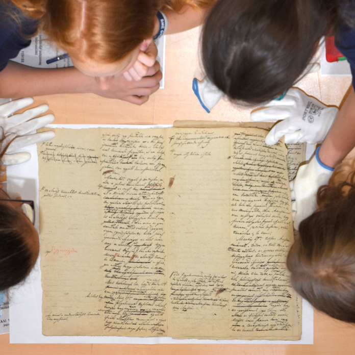

**Batalka Krisztina, Taschek Zoltán**: Levéltáros és történész: e két szakma művelői mozognak legotthonosabban a levéltári iratok között, ők teszik lehetővé, hogy azokat mások is használhassák, megismerhessék, az pedig élményt és tudást adhasson számukra. 

A több mint 240 éves Műegyetem múltját a BME Levéltár őrzi: régi dokumentumokat, fotókat, érdekességeket. A levéltári raktárba csak kevesen léphetnek be, a Kutatók Éjszakáján azonban lehetőség nyílik elmerülni a történelemben.

