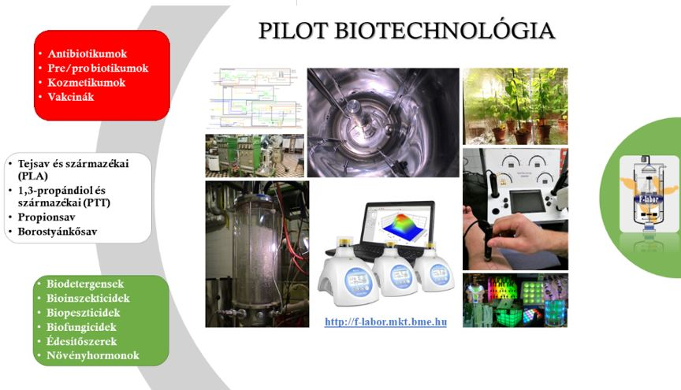

**Dr. Németh Áron**: Docens, munkáját a jogelőd Mezőgazdasági Kémiai Technológia Tanszéken kezdte. 2002-ben végzett biomérnökként Alkalmazott Biotechnológia Szakirányon, majd 2008-ban szerzett PhD fokozatot summa cum laude minősítéssel. Enzimes és mikrobiális technológiák fejlesztése, modellezése és léptéknövelése a fő kutatási és oktatási területe. 7 éve vezeti a Fermentációs Félüzemi Kutató csoportot.
 ///
_He is an Associate professor, started to work at the predecessor Department of Agricultural Chemistry and Technology. He graduated in 2002 as bioengineer with Applied Biotechnology specialization, than obtained PhD degree in 2008 with summa cum laude qualification. His main research and educational fields are the development, modeling and scale up of enzymatic and microbial technologies/processes. He is the Head of Ferementaion Pilot Plant Laboratory leading the researches since 9 years ago._

**Kiss Bernadett** tanársegéd 2012-ben szerzett MSc diplomát a Budapesti Műszaki és Gazdaságtudományi Egyetemen Alkalmazott Biotechnológia szakirányon. 2012-ben kezdte meg tanulmányait PhD hallgatóként az Alkalmazott Biotechnológia és Élelmiszertudományi Tanszéken, majd 2015-től tudományos segédmunkatársként vesz rész a Fermentációs Félüzem munkáiban. Kutatási területe a mikroalga fermentációk vizsgálata, léptéknövelése és modellezése.
 /// 
_She graduated in 2012 as a bioengineer (MSc) at Budapest University of Technology and Economics, Applied Biotechnology. Since 2012 she studies as a PhD student at the Department of Applied Biotechnology and Food Science, then she is working as a research assistant with Fermentation Pilot Plant group since 2015. Her area of research is microalgae fermentation examination, scale up and modelling._

**Eszterbauer Edina**, doktoráns hallgató. Tanulmányait a Budapest Műszaki és Gazdasági Tudomány Egyetemen a Vegyész és Biomérnök Karán MSc biomérnökként 2022ben fejezte be. Jelenleg a BME VBK ABÉT tanszéken folytatja doktori tanulmányait alternatív édesítőszerek innovatív biotechnológia előállításának vizsgálata címmel.
 /// 
_She completed her studies at the Budapest University of Technology and Economics in 2022 as an MSc in biochemical engineer. She is currently pursuing her doctoral studies at the BME VBK ABÉT department, entitled Investigation of innovative biotechnological production of alternative sweeteners._

**Tóth Pál**, doktoráns hallgató. Tanulmányait a Budapest Műszaki és Gazdasági Tudomány Egyetemen a Vegyész és Biomérnök Karán MSc gyógyszervegyész-mérnökként 2019ben fejezte be. Jelenleg a BME VBK ABÉT tanszéken folytatja doktori tanulmányait kozmetikai és étrendkiegészítő komponensek fermentációs előállításának vizsgálata címmel.
 /// _He completed his studies at the Budapest University of Technology and Economics in 2019 as an MSc in pharmaceutical chemical engineer. He is currently pursuing his doctoral studies at the BME VBK ABÉT department, entitled Investigation of the fermentation production of cosmetic and dietary supplement components._

A látogatás során bemutatjuk, hogy az alaptudományok (kémia, biokémia, biológia) folyamatai és jelenségei hogyan befolyásolják a termelő biotechnológiai folyamatokat. Milyen szabályozástechnikai trükkökkel lehet például rávenni a hétköznapi élesztőt, hogy alkohol helyett biomasszát termeljen vagy egy algát, hogy a napfény helyett ecetet egyen, hogyan lehet baktériumokkal és gombákkal kozmetikumokat édesítőszereket előállítani. A látogatók kipróbálhatják a mikroszkópozást, a steril technológiai mintavételezést, a kozmetikai méréseket és megállapítjuk, kinek a „legpiszkosabb” a keze 😊

_During the visit we introduce, how processes and phenomenon’s of basic sciences (like chemistry, biochemistry and biology) affect the production of bioprocesses. What controlling tricks can lead the simple and common baker’s yeast to produce biomass instead of alcohol or some algae to consume acetic acid instead of utilizing sunshine, or how it possible to manufacture cosmetics and sweeteners with bacteria and fungi. Visitors can try microscopes, taking aseptic samples from pilot facility, cosmetic measurements, and we will demonstrate, who has the most dirtiest hands_ 😊

