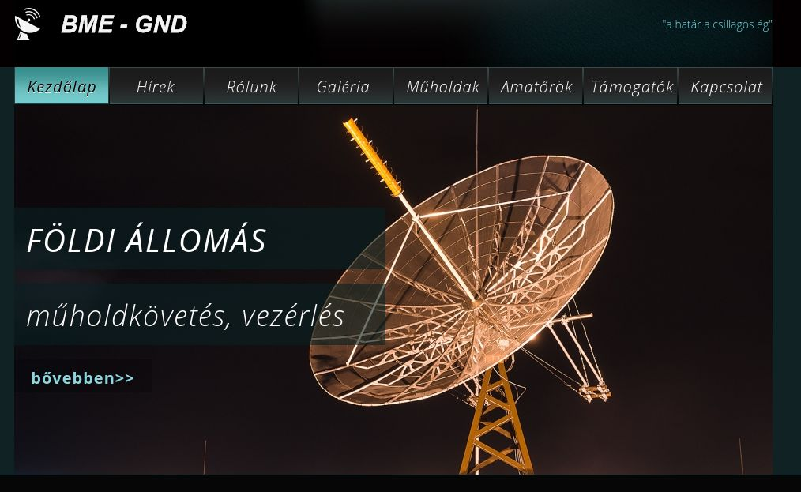

A [földi műhold vezérlő állomás](www.gnd.bme.hu) látogatás során a csoportonként max. 12 résztvevő/turnus,  45-45 perc időtartamban betekintést nyernek a Műegyetemen folyó műhold fejlesztési és műhold űzemeltetési tevékenységbe, mely során részletesen is bemutatásra kerül az eddigi 5 darab magyarországi oktatási célú diákműhold fejlesztés, mint Masat-1, SMOG-P, ATL-1, SMOG-1 és a jelenleg legújabb MRC-100 kisműholdak. **Találkozás minden egész órakor az E épület portán**, onnan együtt megyünk fel a 11. emeletre.

