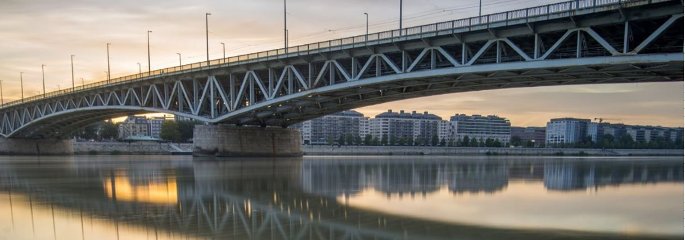

[Dr. Farkas György](https://hsz.bme.hu/farkas-gyorgy): A BME Hidak és Szerkezetek Tanszék professzor emeritusa  
[Dr. Horváth László](https://hsz.bme.hu/horvath-laszlo): BME Hidak és Szerkezetek Tanszék egyetemi docens

A hídlátogatás keretében a látogatóknak lehetőségük van bemenni az Petőfi híd szerkezetébe. A látogatás során bemutatásra kerülnek a Duna-hidak jellemző szerkezeti rendszerei, különös tekintettel az acél gerendahidak szerkezeti kialakítására és sajátosságaira. A program keretében fel lehet menni a híd alatt elhelyezkedő szerelőjárdára is, ahonnan a pályaszerkezet és annak részletei megtekinthetők.

