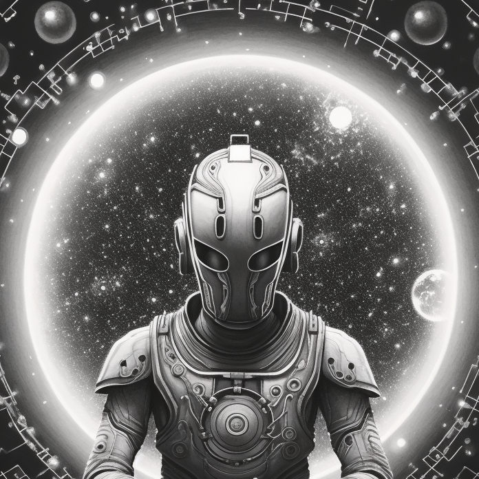

[Héder Mihály](https://www.filozofia.bme.hu/people/mihaly.heder) filozófus-informatikus, kutatási témája a mesterséges intelligencia etikája.

Az eseményen Héder Mihály bemutatja a Mesterséges Intelligenciával kapcsolatban felhozott meggyőző, ám teljesen téves érvek egy fontos családját: azt, amelyikben az érvelő arra hivatkozva, hogy „a számítógép pusztán utasításokat hajt végre” eltagadja annak érdemeit, tulajdonságait és lehetőségeit.

