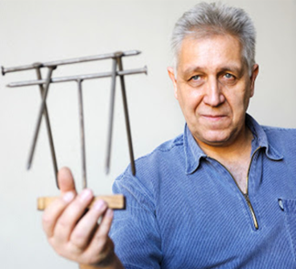

[Härtlein Károly](https://hu.wikipedia.org/wiki/H%C3%A4rtlein_K%C3%A1roly), a BME TTK mesteroktatója, több évtizede foglalkozik a tudomány népszerűsítésével. Príma Primisszima díjas. 

Környezetszennyezés, energiaellátás, fenntartható fejlődés ezek legfontosabb mindenkit érintő problémák. A természettudományok alapos ismerete adhat helyes választ korunk megválaszolandó kérdéseire és adhat megoldást problémáinkra. A fizikának nagyon fontos szerepe van a természettudományos szemlélet megalapozásában. Ebben az előadásban az intézetünkben bemutatható kísérletekből válogatok, azt szeretném megmutatni, hogy a fizika mennyire szövi át a mindennapjainkat, és ezzel rávilágítani a fizika tudás-tanulás fontosságára.

