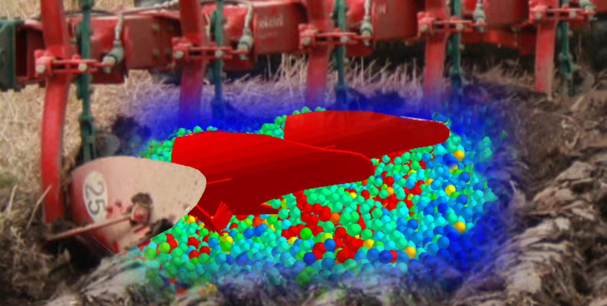

[Dr. Tamás Kornél](https://gt3.bme.hu/oktatoi_oldal.php?lepes=4&oid=162) a BME Gép- és Terméktervezés Tanszék egyetemi docense, ahol MSc fokozatot szerzett, majd PhD fokozatot szerzett. Szakterülete a szemcsés anyagok modellezése diszkrét elem módszerrel (DEM). _E-mail címe:_ tamas.kornel@gt3.bme.hu

[Pásthy László](https://gt3.bme.hu/oktatoi_oldal.php?lepes=4&oid=190) a BME Gép- és Terméktervezés Tanszék PhD hallgatója, ahol MSc fokozatot szerzett. Kutatási területe a kapcsolt diszkrét elemes (DEM) szimulációk. _E-mail címe:_ pathy.laszlo@gt3.bme.hu

**Szabó Bence** a BME Gép- és Terméktervezés Tanszék MSc hallgatója. Érdeklődési köre az additív gyártási eljárások, valamint a talaj-szerszám kölcsönhatásának vizsgálata. _E-mail címe:_ szabo.bence@gt3.bme.hu

**Gräff József Balázs** a BME Mechatronikai mérnök szakán BSc hallgató, valamint a BME Mechatronika Szakosztály konzultációs csoportjának vezetője. Kutatási területei az alacsony szintű-, és nagyteljesítményű szoftverfejlesztés. _E-mail címe:_ graffjoco@gmail.com

[Hudoba Zoltán](https://gt3.bme.hu/oktatoi_oldal.php?lepes=4&oid=129) a BME Gép- és Terméktervezés Tasnzék mesteroktatója. Szakterülete a talajművelő gépek szántóföldi munkaminőségi, energetikai és üzemi vizsgálata, valamint a talajművelési eljárások, technológiák kutatása, fejlesztése, innovációja. _E-mail címe:_ hudoba.zoltan@gt3.bme.hu

**Nagy Balázs Martin**, mechatronikai mérnök, a BME GPK gépészeti modellezés mesterszakos hallgatója. Érdeklődési köre a szimulációs eljárások, szilárdtest mechanika, képelemzés, valamint a szemcsés anyagok keveredésének vizsgálata. _Elérhetősége_: balazs.martin.nagy@gmail.com

[Dr. Farkas Zsolt](https://gt3.bme.hu/oktatoi_oldal.php?lepes=4&oid=120) a BME Gép- és Terméktervezés Tanszékének adjunktusa. Kutatási területe a jármű hajtáslánc analízise, szimulációja, fokozatmentes hajtóművek, pneumatika, hidraulika. _E-mail címe:_ farkas.zsolt@gt3.bme.hu

A program keretében bemutatásra kerül a **szemcsés anyagok modellezésére alkalmas diszkrételemes módszer**. Betekintést engedünk a témában folyó kutatásainkba, és az ezekhez fejlesztett mérőeszközök és számítógépes programok működésébe.

