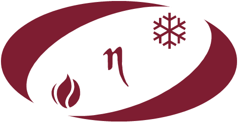

[A BME Energetikai Gépek és Rendszer munkatársai](http://www.energia.bme.hu/munkatarsak/), [BME EGR Tanszék](http://www.energia.bme.hu/munkatarsak/),
[BME Shark Team](https://sharkteam.eu/), [Kalorikus Gépek Szakosztály](https://www.facebook.com/kalorszakosztaly)

Érdekelnek a motorok? A program során megnézheted, hogyan ég bennük a tüzelőanyag, megtudhatod hogyan hajthat meg motort pusztán egy csésze tea, és milyen messze jut egy fecskendőnyi üzemanyaggal BME-s versenycsapat autója. Nem elég? Van vízrakétánk is!

